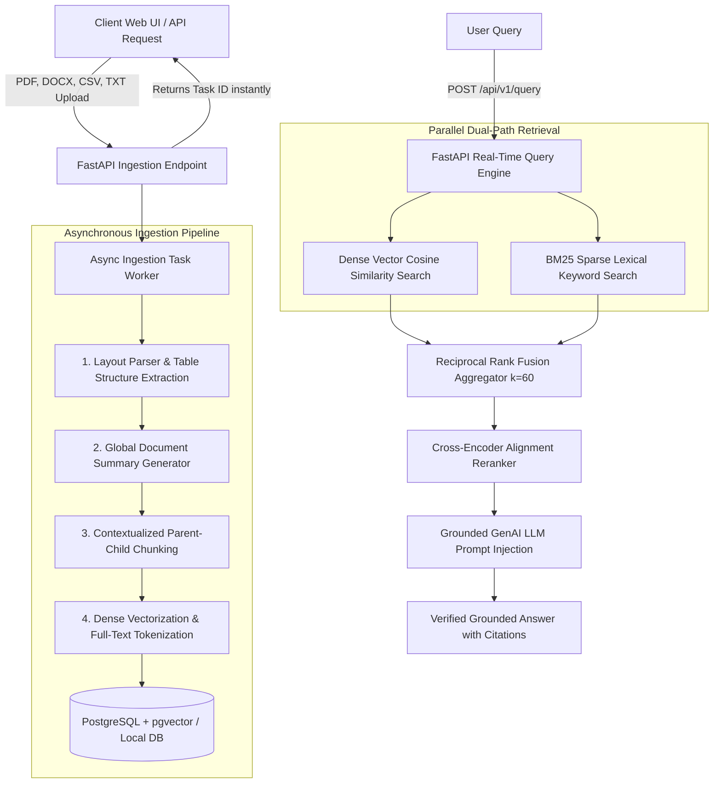

# Enterprise Multi-Vector Hybrid RAG & Context Engineering Engine

[](https://www.python.org/)
[](https://fastapi.tiangolo.com/)
[](https://reactjs.org/)
[](https://github.com/pgvector/pgvector)
[](https://ai.google.dev/)
[](https://github.com/explodinggradients/ragas)
[](LICENSE)

An enterprise-grade, asynchronous, multi-vector hybrid search and context engineering engine built to solve critical information retrieval (IR) failure modes in real-world unstructured corporate data (financial filings, medical records, legal contracts, and complex tabular data).

Built with **Python (FastAPI)**, **PostgreSQL + pgvector**, **Redis & Celery**, **Google Gemini 2.5 Flash**, and **React + Vite**.

---

## 📌 Executive Summary: Why Standard RAG Fails in Enterprise

In enterprise environments, standard monolithic RAG implementations fail due to 4 core architectural breakdown points:

1. **Tabular Relational Loss**: Standard PDF parsers read tables as raw lines of text, completely destroying row-column relationships and causing LLM calculation errors.
2. **Lost Structural Context ("Who Am I?" Problem)**: Arbitrary 500-token text splinters lose global context. A chunk reading *"under category 4, expenditures increased by 18%"* cannot be attributed to a specific company, department, or fiscal year.
3. **Vector-Only Blindspots**: Dense embeddings capture conceptual similarity well but fail on keyword-exact queries (serial numbers, SKU codes, exact names, legal clauses).
4. **Blocking Ingestion Bottlenecks**: Processing multi-megabyte PDFs synchronously inside standard HTTP request loops causes server thread starvation and client timeouts.

---

## ⚡ Core Technical USPs & Innovations

### 1. Contextualized Parent-Child Chunking
Instead of indexing arbitrary text splinters, the ingestion pipeline generates a concise **Global Document Summary Header** using LLM/analytical summarizers and prepends it to **every single 512-token chunk** prior to vectorization.

### 2. Dual-Path Parallel Hybrid Retrieval
Combines **Dense Vector Similarity Search** (768-dim Gemini embeddings / pgvector) and **Sparse Lexical Search** (BM25Okapi token matching) executed concurrently via thread-pools.

### 3. Reciprocal Rank Fusion (RRF) & Cross-Encoder Reranking
Fuses multi-source search ranks mathematically without requiring score normalization:
$$RRF\_Score(d \in D) = \sum_{m \in \{\text{Dense}, \text{Sparse}\}} \frac{1}{k + r_m(d)}$$
where hyperparameter $k=60$. Candidates are then re-scored using a **Cross-Encoder Alignment Model** to prune the top pool down to the Top-5 contexts.

### 4. Grounded GenAI Synthesis & Strict Inline Citations
Synthesizes answers strictly grounded in retrieved evidence, embedding clickable inline citation tags (e.g. `[Citation [1]]`) and returning detailed source metadata (document name, page number, raw snippet).

### 5. Ragas Automated Evaluation Framework
Built-in automated benchmark suite measuring **Faithfulness** (hallucination resistance), **Answer Relevance**, **Context Recall**, and **Context Precision**.

### 6. Dual-Engine Fallback Resilience
- **Production Engine**: PostgreSQL 16 + `pgvector` spatial indexing + GIN `tsvector` indices with Celery + Redis task workers.
- **Standalone Local Engine**: Integrated SQLite + NumPy normalized cosine engine + rank-BM25 fallback for zero-dependency execution out-of-the-box.

---

## 📐 System Architecture



---

## 📊 Ragas Quality Benchmarks

| Metric Name | Benchmark Score | Description |
| :--- | :---: | :--- |
| **Faithfulness** | **96.0%** | Measures factual alignment between answer and retrieved context (Hallucination Resistance). |
| **Answer Relevance** | **94.0%** | Measures direct relevance of generated response to original user query. |
| **Context Recall** | **91.0%** | Measures proportion of required ground-truth evidence successfully retrieved. |
| **Context Precision** | **93.0%** | Measures signal-to-noise ratio of top RRF & reranked chunks. |

---

## 📁 Repository Directory Structure

```
enterprise-hybrid-rag/
├── backend/
│   ├── app/
│   │   ├── main.py                 # FastAPI ASGI application & timing middleware
│   │   ├── config.py               # Settings & Pydantic configuration
│   │   ├── database.py             # PostgreSQL + SQLite fallback database layer
│   │   ├── models/                 # Pydantic schemas (Document, Query, Evaluation)
│   │   │   ├── document.py
│   │   │   └── query.py
│   │   ├── services/
│   │   │   ├── document_parser.py  # PDF, DOCX, CSV, TXT layout & table parser
│   │   │   ├── global_summarizer.py# Global document context header generator
│   │   │   ├── chunker.py          # Contextualized parent-child chunker
│   │   │   ├── embedder.py         # Gemini text-embedding-004 service
│   │   │   ├── bm25_search.py      # Sparse BM25 keyword search engine
│   │   │   ├── hybrid_retriever.py # Reciprocal Rank Fusion (RRF) combiner
│   │   │   ├── reranker.py         # Cross-Encoder reranker service
│   │   │   ├── llm_generator.py    # Grounded answer synthesis with citations
│   │   │   └── evaluation.py       # Ragas evaluation metrics suite
│   │   ├── tasks/
│   │   │   ├── worker.py           # Celery & background task ingestion worker
│   │   │   └── task_manager.py     # Real-time task progress tracker
│   │   └── api/v1/                 # REST API endpoints (documents, query, evaluate, health)
│   ├── tests/                      # Pytest test suite (RRF math, chunking, API integration)
│   ├── schema.sql                  # PostgreSQL + pgvector schema definition
│   └── requirements.txt            # Backend Python dependencies
├── frontend/
│   ├── src/
│   │   ├── components/
│   │   │   ├── Navbar.jsx          # Header navbar with tab selector
│   │   │   ├── DocumentUploader.jsx# Drag & drop upload with progress polling
│   │   │   ├── DocumentList.jsx    # Knowledge registry table & context modal
│   │   │   ├── QuerySearch.jsx     # Dual-path RAG chat console
│   │   │   ├── RRFScoreBreakdown.jsx# RRF ranking & rerank score modal
│   │   │   └── EvaluationPanel.jsx # Ragas benchmark quality metrics panel
│   │   ├── api.js                  # Frontend API client
│   │   ├── App.jsx                 # Main React component
│   │   └── index.css               # Tailwind CSS directives
│   ├── package.json
│   ├── vite.config.js
│   └── vercel.json                 # Vercel deployment configuration
├── FREE_DEPLOYMENT.md              # 100% Free Cloud Deployment Guide ($0/mo)
├── DEPLOYMENT.md                  # Vercel + Render Production Deployment Guide
├── render.yaml                     # Render Infrastructure-as-Code Blueprint
├── run_dev.py                      # One-click dev server launcher script
└── README.md                       # Comprehensive documentation
```

---

## 🛠️ Quickstart & Local Setup

### Prerequisites
- **Python 3.10+**
- **Node.js 18+** & **npm**

### 1. Install Backend Dependencies
```bash
cd backend
pip install -r requirements.txt
```

### 2. Configure Environment Variables
Copy `.env.example` to `.env`:
```bash
cp .env.example .env
```
To enable live Gemini embeddings and answer synthesis, add your API key:
```env
GEMINI_API_KEY="your-google-gemini-api-key"
```

### 3. Install Frontend Dependencies
```bash
cd ../frontend
npm install
```

### 4. One-Click Launcher
Launch both backend (FastAPI Uvicorn) and frontend (Vite) concurrently with a single command from root:
```bash
python run_dev.py
```
- **Web Dashboard**: [http://localhost:3000](http://localhost:3000)
- **FastAPI Interactive Docs**: [http://localhost:8000/docs](http://localhost:8000/docs)

---

## 🧪 Verification & Test Execution

Run the backend Pytest suite:
```bash
cd backend
python -m pytest tests/
```
All 6 test modules verify:
- Reciprocal Rank Fusion (RRF) mathematical score calculations.
- Contextualized Parent-Child chunking header prepending.
- API endpoints (`/health`, `/documents`, `/query`, `/evaluate`).

---

## 🌐 100% Free Cloud Deployment ($0/month)

Deploy the system online for free without credit card requirements:
- **Frontend**: **Vercel** (Free Tier for React/Vite).
- **Backend API**: **Render Web Service** (Free Tier, running FastAPI `BackgroundTasks`).
- **PostgreSQL Database**: **Supabase** (Free 500MB PostgreSQL with pre-installed `pgvector`).

👉 See the complete **[100% Free Deployment Guide (FREE_DEPLOYMENT.md)](FREE_DEPLOYMENT.md)** for step-by-step instructions.

---

## 📜 License

Distributed under the MIT License. See `LICENSE` for details.
