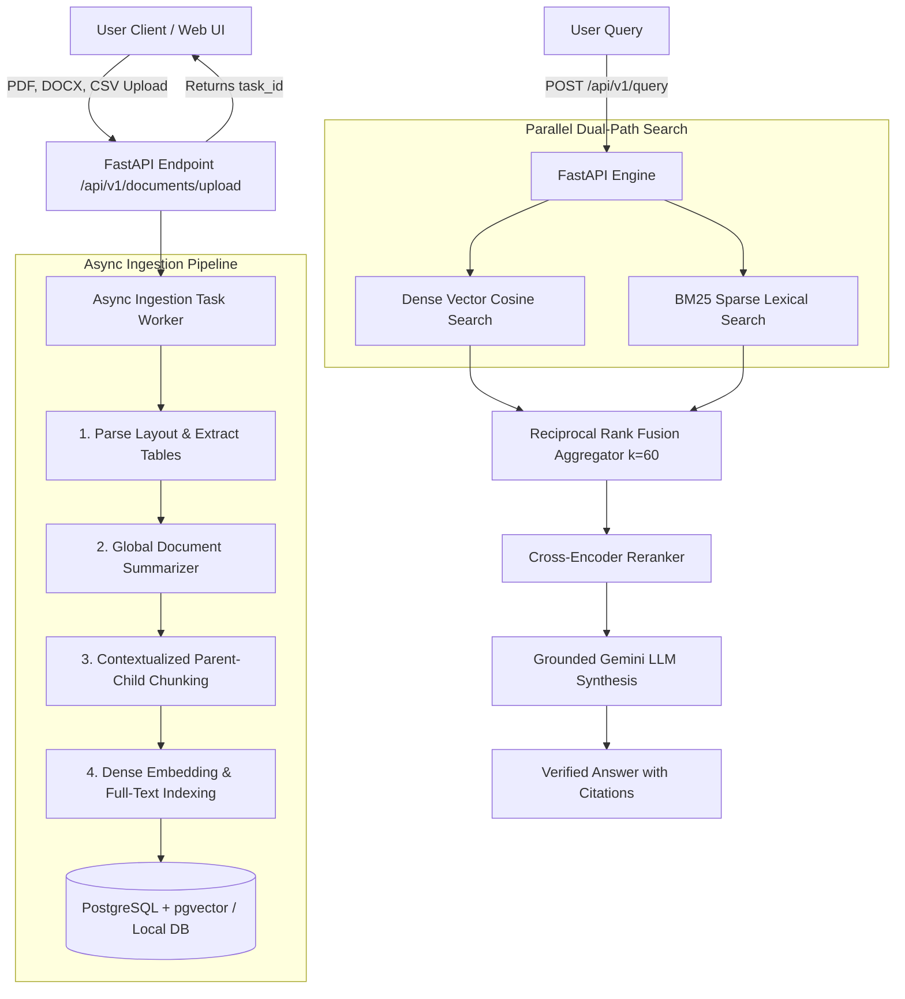

# Enterprise Multi-Vector Hybrid RAG Search Engine

An enterprise-grade, asynchronous, multi-vector hybrid search and context engineering engine built with **Python (FastAPI)**, **PostgreSQL + pgvector**, **Redis & Celery**, **Google Gemini 2.5 Flash**, and **React + Vite**.

Instead of relying on naive semantic embeddings, this system combines **Dense Vector Representations**, **Sparse Lexical Search (BM25)**, **Contextualized Parent-Child Chunking**, and **Reciprocal Rank Fusion (RRF)** to deliver highly accurate, hallucination-resistant knowledge retrieval with strict citation attribution.

---

## 🚀 100% FREE Deployment Option ($0/mo, No Credit Card Required)

You do **NOT** need to pay money to host this project! We have designed a 100% free stack:
- **Frontend**: **Vercel** (Free Tier)
- **Backend API**: **Render Web Service** (Free Tier, running FastAPI `BackgroundTasks`)
- **PostgreSQL Database + pgvector**: **Supabase** (Free 500MB Database with pre-installed `pgvector`)

👉 See the complete **[100% FREE Deployment Guide (FREE_DEPLOYMENT.md)](FREE_DEPLOYMENT.md)** for step-by-step instructions!

---

## 🌟 Key USPs & Architectural Innovations

1. **Contextualized Parent-Child Chunking**:
   - Generates a high-level global document summary header via LLM/analytical summarizer.
   - Prepends this global context header to every single ~512-token chunk before vectorization, eliminating the "Who Am I?" lost structural context problem in large enterprise filings.

2. **Dual-Path Hybrid Retrieval**:
   - Executes **Dense Semantic Vector Search** (pgvector / Gemini embeddings) and **Sparse Lexical Search** (BM25 token matching) in parallel using Python thread-pools.
   - Eliminates vector-only failure modes when querying for exact codes, numbers, SKU IDs, or proper names.

3. **Reciprocal Rank Fusion (RRF) & Cross-Encoder Reranking**:
   - Mathematically merges multi-source search ranks using RRF:
     $$RRF\_Score(d \in D) = \sum_{m \in M} \frac{1}{k + r_m(d)}$$
     where $k=60$.
   - Re-scores candidate contexts using a Cross-Encoder alignment step to prune top candidates down to the top 5 most relevant contexts.

4. **Grounded Answer Synthesis with Strict Inline Citations**:
   - Generates answers strictly grounded in retrieved evidence, embedding clickable inline citation chips (e.g. `[Doc: prospectus.pdf, Page 12]`) and verified snippet metadata.

5. **Ragas Evaluation Suite**:
   - Built-in evaluation endpoints measuring **Faithfulness** (hallucination resistance), **Answer Relevance**, **Context Recall**, and **Context Precision**.

6. **Dual Execution Engine Support**:
   - **Production Mode**: PostgreSQL + `pgvector` database with Celery + Redis worker task queue.
   - **Local Standalone Mode**: Built-in SQLite + NumPy vector engine fallback so the system runs immediately out-of-the-box on any desktop environment without needing external daemon setup!

---

## 📁 System Architecture



---

## ⚙️ Installation & Quickstart

### Prerequisites
- **Python 3.10+**
- **Node.js 18+** & **npm**

### 1. Install Backend Dependencies
```bash
cd backend
pip install -r requirements.txt
```

### 2. Configure Environment Variables
Copy `.env.example` to `.env`:
```bash
cp .env.example .env
```
To enable live Gemini embeddings and answer synthesis, add your API key in `.env`:
```env
GEMINI_API_KEY="your-google-gemini-api-key"
```

### 3. Install Frontend Dependencies
```bash
cd ../frontend
npm install
```

### 4. Run the Full Application
Launch both backend and frontend dev servers concurrently with a single command from the project root:
```bash
python run_dev.py
```
- **Web Dashboard**: [http://localhost:3000](http://localhost:3000)
- **FastAPI Interactive Docs**: [http://localhost:8000/docs](http://localhost:8000/docs)
